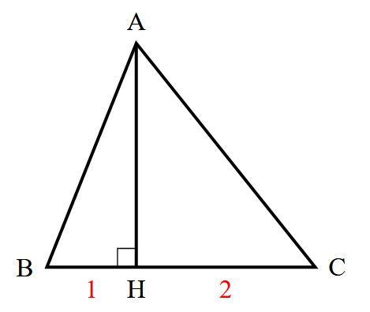

# Exercice : Géométrie analytique et Produit Scalaire

**Niveau :** Première Spécialité Mathématiques  
**Thème :** Coordonnées, mesure d'angles, orthogonalité et projections.

---

## Énoncé

**Exercice 1: Calculer un produit scalaire avec un angle**

On considère un triangle $ABC$ tel que $AB = 5$, $AC = 7$ et l'angle $\widehat{BAC} = 60^\circ$.

2. Calculer le produit scalaire $\overrightarrow{AB} \cdot \overrightarrow{AC}$.

*Correction :*
$\overrightarrow{AB} \cdot \overrightarrow{AC} = 5 \times 7 \times \cos(60^\circ) = 35 \times \frac{1}{2} = 17.5$

3. Déterminer la valeur exacte de $\cos(\widehat{BAC})$.

*Correction :*
$\cos(\widehat{BAC}) = \dfrac{\overrightarrow{AB} \cdot \overrightarrow{AC}}{||\overrightarrow{AB}|| \times ||\overrightarrow{AC}||}$

Calculons les normes :  
$||\overrightarrow{AB}|| = \sqrt{5^2} = 5$  
$||\overrightarrow{AC}|| = \sqrt{7^2} = 7$   

$\cos(\widehat{BAC}) = \dfrac{17.5}{5 \times 7} = \dfrac{17.5}{35} = \dfrac{1}{2}$

4. En déduire une mesure de l'angle $\widehat{BAC}$ arrondie au dixième de degré.

$\widehat{BAC} = \arccos\left(\dfrac{1}{2}\right) = 60^\circ$

---

**Exercice 2: Produit scalaire et géométrie analytique**

On considère un repère orthonormé $(O; \overrightarrow{i}, \overrightarrow{j})$ et les points suivants :
$A(2 ; 3)$, $B(5 ; 7)$ et $C(1 ; 2)$.

1. Calculer les coordonnées des vecteurs $\overrightarrow{AB}$ et $\overrightarrow{AC}$.

*Correction :*  
$\overrightarrow{AB} = (5 - 2 ; 7 - 3) = (3 ; 4)$  
$\overrightarrow{AC} = (1 - 2 ; 2 - 3) = (-1 ; -1)$

2. Calculer le produit scalaire $\overrightarrow{AB} \cdot \overrightarrow{AC}$.

$\overrightarrow{AB} \cdot \overrightarrow{AC} = 3 \times (-1) + 4 \times (-1) = -3 - 4 = -7$

3. Déterminer la valeur exacte de $\cos(\widehat{BAC})$.

$\cos(\widehat{BAC}) = \dfrac{\overrightarrow{AB} \cdot \overrightarrow{AC}}{||\overrightarrow{AB}|| \times ||\overrightarrow{AC}||}$

Calculons les normes :  
$||\overrightarrow{AB}|| = \sqrt{3^2 + 4^2} = 5$  
$||\overrightarrow{AC}|| = \sqrt{(-1)^2 + (-1)^2} = \sqrt{2}$   

$\cos(\widehat{BAC}) = \dfrac{-7}{5 \times \sqrt{2}} = \dfrac{-7}{5\sqrt{2}}$

4. En déduire une mesure de l'angle $\widehat{BAC}$ arrondie au dixième de degré.

$\widehat{BAC} = \arccos\left(\dfrac{-7}{5\sqrt{2}}\right)$
Calculons cette valeur :
$\widehat{BAC} \approx \arccos(-0.9899) \approx 170.5^\circ$

---

**Exercice 3: Produit scalaire et projeté orthogonal**

1. Calculer le produit scalaire $\overrightarrow{BC} \cdot \overrightarrow{BA}$ 

$\overrightarrow{BC} \cdot \overrightarrow{BA} = \overrightarrow{BC} \cdot \overrightarrow{BH} = ||\overrightarrow{BC}|| \times ||\overrightarrow{BH}|| = 1 \times 2 = 2$

**Exercice 4: Calculs de produits scalaires et applications**

Soit $\overrightarrow{u} $ et $\overrightarrow{v}$ deux vecteurs du plan de coordonnées respectives $(3 ; 4)$ et $(-2 ; 5)$.

1. Calculer le produit scalaire $\overrightarrow{u} \cdot \overrightarrow{v}$.

*Correction :*
$\overrightarrow{u} \cdot \overrightarrow{v} = 3 \times (-2) + 4 \times 5 = -6 + 20 = 14$

2. Calculer les normes de $\overrightarrow{u}$ et $\overrightarrow{v}$.

*Correction :*
$||\overrightarrow{u}|| = \sqrt{3^2 + 4^2} = 5$  

$||\overrightarrow{v}|| = \sqrt{(-2)^2 + 5^2} = \sqrt{4 + 25} = \sqrt{29}$

3. Déterminer la valeur exacte de $\cos(\widehat{u,v})$

*Correction :*

$\cos(\widehat{u,v}) = \dfrac{\overrightarrow{u} \cdot \overrightarrow{v}}{||\overrightarrow{u}|| \times ||\overrightarrow{v}||} = \dfrac{14}{5\sqrt{29}}$

4. En déduire une mesure de l'angle $\widehat{u,v}$ arrondie au dixième de degré.

*Correction :*

$\widehat{(u,v)} = \arccos\left(\dfrac{14}{5\sqrt{29}}\right)$

Calculons cette valeur :

$\widehat{(u,v)} \approx \arccos(0.822) \approx 35.1^\circ$

---

**Exercice 5: Orthogonalité et produit scalaire**

Dans chaque cas, calculer $\overrightarrow{u} \cdot \overrightarrow{v}$ en fonction de $m$ et déterminer les valeurs de $m$ pour lesquelles les vecteurs $\overrightarrow{u}$ et $\overrightarrow{v}$ sont orthogonaux.

1. $\overrightarrow{u}\left(-5; 2)\right)$ et $\overrightarrow{v}\left(m; -2\right)$

*Correction :*

$\overrightarrow{u} \cdot \overrightarrow{v} = (-5) \times m + 2 \times (-2) = -5m - 4$

Pour que les vecteurs soient orthogonaux, il faut que $\overrightarrow{u} \cdot \overrightarrow{v} = 0$ :

$-5m - 4 = 0 \Rightarrow m = -\frac{4}{5}$  

2. $\overrightarrow{u}\left(m-4; 2m+1\right)$ et $\overrightarrow{v}\left(2m; 3-m\right)$

*Correction :*

$\overrightarrow{u} \cdot \overrightarrow{v} = (m-4) \times 2m + (2m+1) \times (3-m)$

$= 2m^2 - 8m + 6m -2m^2 + 3 - m$

$= -3m+3$

Pour que les vecteurs soient orthogonaux, il faut que $\overrightarrow{u} \cdot \overrightarrow{v} = 0$ :

$-3m+3 = 0 $ soit $m = 1$ 

3. $\overrightarrow{u}\left(m; 3-m\right)$ et $\overrightarrow{v}\left(2; -m\right)$

*Correction :*

$\overrightarrow{u} \cdot \overrightarrow{v} = m \times 2 + (3-m) \times (-m)$

$= 2m - 3m + m^2$

$= m^2 - m$     

Pour que les vecteurs soient orthogonaux, il faut que $\overrightarrow{u} \cdot \overrightarrow{v} = 0$ :

$m^2 - m = 0 \Rightarrow m(m - 1) = 0$

Les solutions sont $m = 0$ ou $m = 1$.  

Pour $m = 0$, $\overrightarrow{u} \cdot \overrightarrow{v} = 0$ et les vecteurs sont orthogonaux.  

Pour $m = 1$, $\overrightarrow{u} \cdot \overrightarrow{v} = 0$ et les vecteurs sont également orthogonaux.

---

---