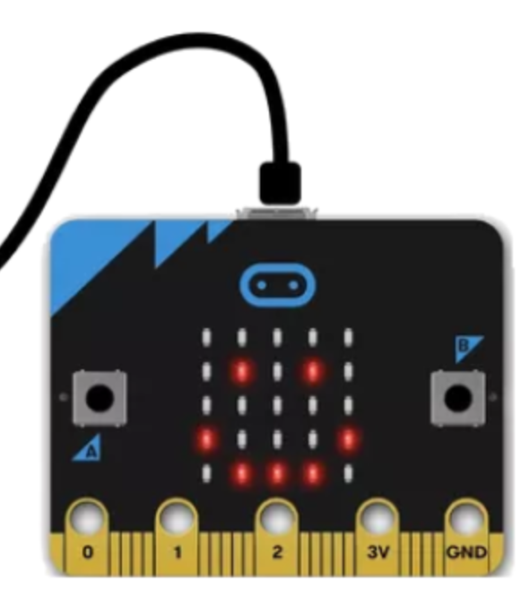
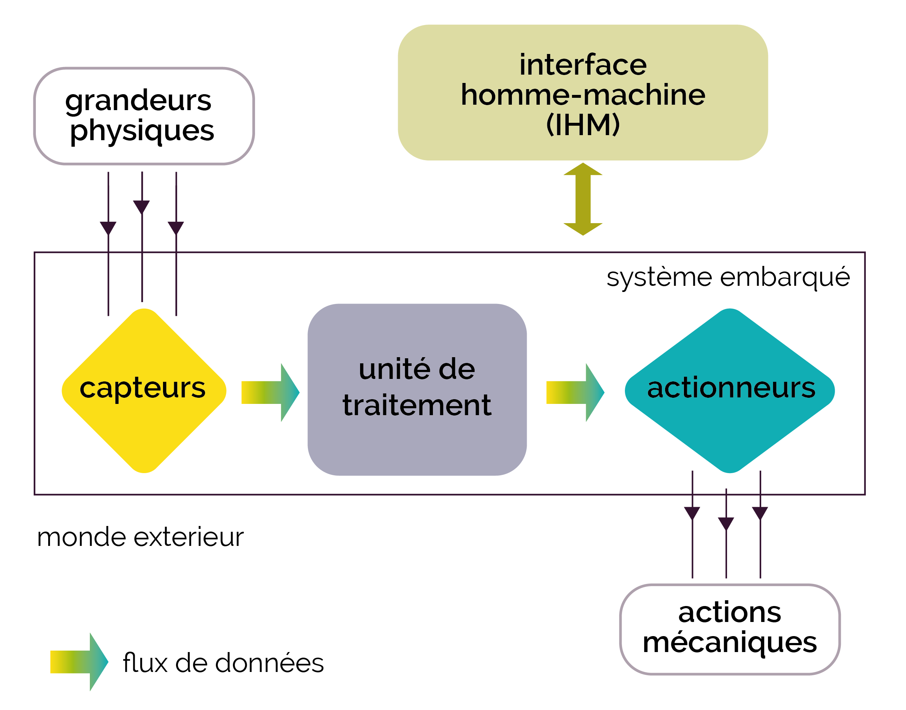
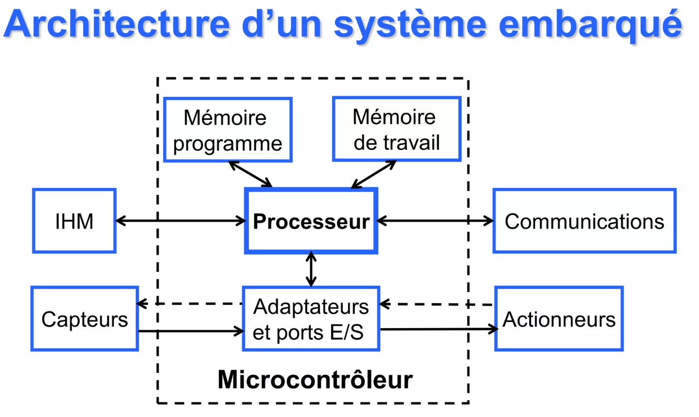
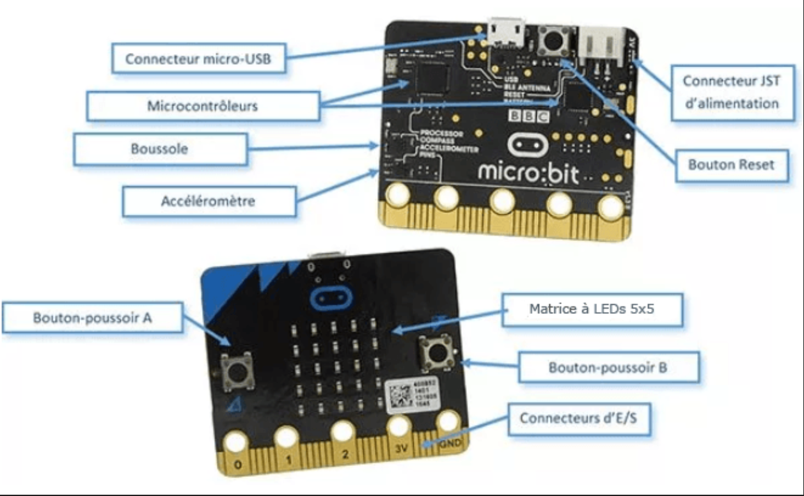

---
## 📌 Partie 1 — Qu'est-ce que l'informatique embarquée ?

Un **système informatique embarqué** est un système informatique intégré directement dans un objet pour contrôler son fonctionnement.

Contrairement à un ordinateur classique, il est :
- **dédié** à une tâche précise
- **miniaturisé** (souvent un microprocesseur peu coûteux)
- souvent soumis à des **contraintes de temps réel** (il doit répondre rapidement)

### 🕰️ Quelques repères historiques

| Année | Événement |
|-------|-----------|
| 1967  | 1er système embarqué : guidage de la mission lunaire Apollo |
| 1971  | 1er microprocesseur (Intel) |
| 1984  | Airbus A320 : 1er avion à commandes électriques informatisées |
| 1998  | Météor (ligne 14 Paris) : 1er métro sans conducteur |
| 1999  | Naissance de l'expression « Internet des objets » |
| 2007  | Arrivée du smartphone |
| 2020  | ~50 milliards d'objets connectés dans le monde |

-----------------

---
## 📌 Partie 2 — Les composants d'un système embarqué

Un système embarqué interagit avec le monde physique grâce à 3 types de composants :

---
## 📌 Partie 3 — Les objets connectés et l'Internet des Objets (IoT)

Un objet **connecté** est un objet embarqué qui communique via un réseau (souvent Internet ou Bluetooth ou Wi-Fi).

L'ensemble de ces objets forme l'**Internet des Objets** (*Internet of Things*, IoT).

Grâce au smartphone, on peut désormais contrôler de nombreux objets depuis une seule interface unifiée.

### 🌍 Exemples d'applications
- **Domotique** : éclairage, chauffage, alarme, électroménager
- **Santé** : montres connectées, tensiomètres, glucomètres
- **Transport** : voiture connectée, trottinette partagée
- **Agriculture** : capteurs d'humidité des sols, drones
- **Industrie** : robots de chaîne de montage

### 🔍 Les capteurs
Un **capteur** mesure une grandeur physique et la convertit en signal numérique.

Exemples : thermomètre, accéléromètre, caméra, microphone, capteur de luminosité, GPS...

### ⚙️ Les actionneurs
Un **actionneur** reçoit un signal numérique et produit une action physique.

Exemples : moteur, LED, haut-parleur, écran, pompe, résistance chauffante...

### 🖥️ L'IHM (Interface Homme-Machine)
L'**IHM** permet à un humain d'interagir avec le système.

Exemples : boutons, écran tactile, application smartphone, télécommande...

---
## 🏁 Synthèse — À retenir

Complétez cette synthèse avec vos propres mots :

- Un système informatique embarqué est ...
- Un **capteur** permet de ...
- Un **actionneur** permet de ...
- Une **IHM** permet de ...
- Un objet **connecté** est un objet embarqué qui ...
- Les principaux risques liés aux objets connectés sont ...

